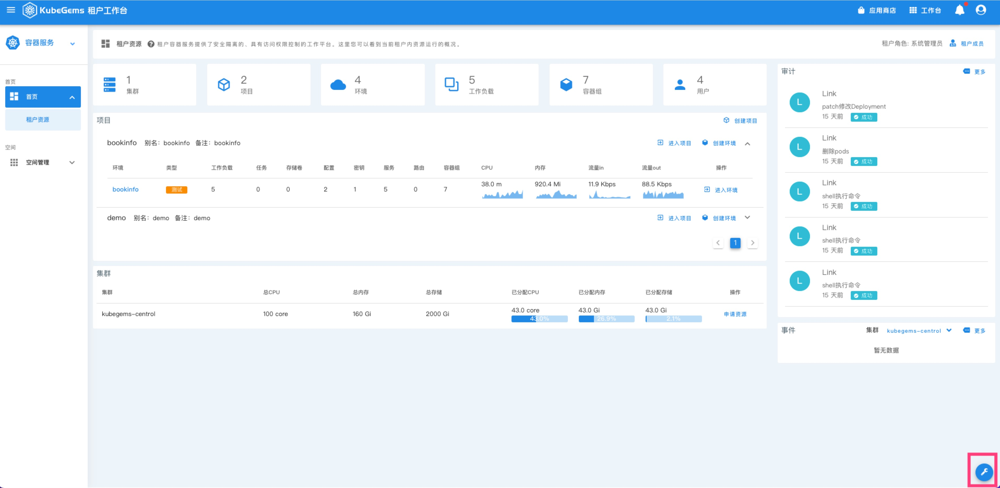
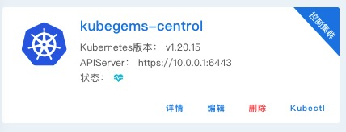
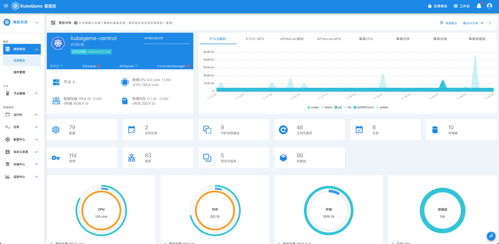

## 概述

KubeGems 本身不会维护 Kubernetes 集群，而是通过 `kubeconfig` 对集群进行管理。KubeGems 在导入集群中，会创建名称为 `kubegems-installer` 的命名空间，并下发`CRD/installers.plugins.kubegems.io` 以及关联的 `CR/installer` 资源。

 **Installer** 中定义了作为添加集群所需要的核心组件，`installer-operator` 控制器通过 **kubegems-plugins** 中描述的插件，对集群内安装平台功能依赖的插件。

|namesapce|作用|
|---|---|
|gemcloud-gateway-system| 租户网关插件运行的namespace|
|gemcloud-logging-system|日志采集和查询相关服务运行的namespace|
|gemcloud-monitoring-system|监控告警相关服务运行的namespace|
|gemcloud-workflow-system|部署流程相关组件运行的namespace|
|gemcloud-system|kubegems核心组件agent+controller运行的namespace|

### 集群导入

1. 点击页面页面右下角扳手按钮，进入 KubeGems 平台管理

:::tip
【平台管理】仅拥有 系统admin 权限下可见。
:::

2. 进入集群里面后，点击 【创建集群】卡片，并填写需纳入 KubeGems 管理的 Kubernetes 配置文件。

3. 写入集群基本信息,并提交

|字段|作用|
|---|:---|
|集群名字|集群名字在kubegems必须唯一，且满足命名规范|
|存储卷类型| KubeGems及依赖生态组件在安装过程中依赖的存储卷类型，默认为 local-storage |
|镜像仓库| KubeGems 及依赖生态组件的镜像库地址，默认支持 docker.io 和 阿里云镜像仓库 |

:::tip
如果您需要将 KubeGems 的镜像同步至您私有的镜像仓库，建议在此输入您的私有镜像仓库地址
:::

4. 等待集群状态正常

当集群添加成功， installer-operator安装完成后，集群的状态会显示为正常 (一个绿色的 💚 )

### 集群详情

点击【集群】卡片上的 “详情” 可进入集群的详情页，在此可以浏览集群更详细的数据。

### 集群删除

:::warning
集群删除属于危险操作，操作前请务必确保该集群下所关联的【环境】下资源已被删除，否则删除集群会失败！
:::