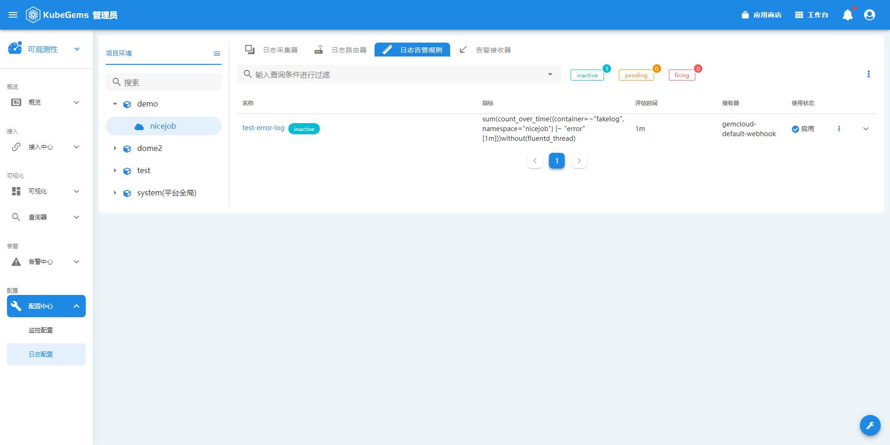
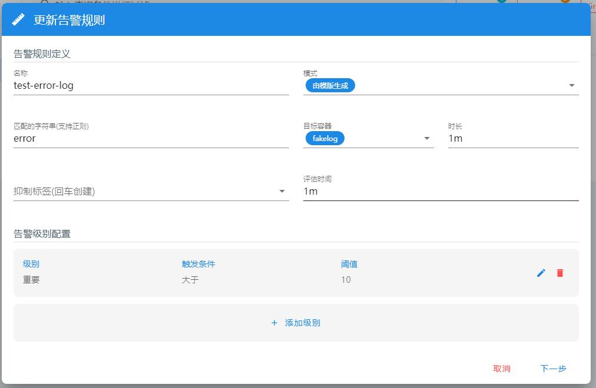
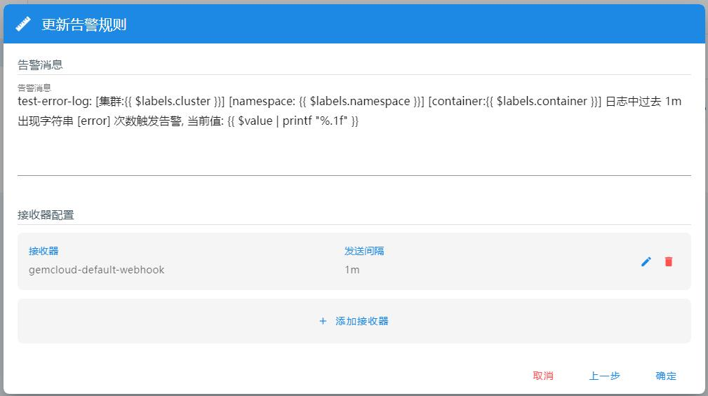

## 日志告警

通过配置 _告警接收器_ 与 _告警规则_，Kubegems平台会在告警触发时将相关告警信息分发至对应渠道，同时，每条告警也会发送至平台内部，用以平台通知、存档。

### 告警接收器

1. 点击左上角，选择**可观测性**
2. 在可观测性栏目，选择**配置中心-日志配置**
3. 选择对应的项目-环境后，点击**告警接收器**

日志告警接收器与监控告警接收器的配置与使用方式完全一致，要了解更多请参阅[监控告警接收器](/docs/tasks/observability/monitoring/alert)

### 告警规则

告警规则配置平台的告警策略，告警触发时按配置发送给对应的接收器

1. 点击左上角，选择**可观测性**
2. 在可观测性栏目，选择**配置中心-监控配置**
3. 选择对应的项目-环境后，点击**日志告警规则**

:::tip 小知识
你会关注到每个告警规则名称后跟了个状态栏，这是表示告警规则当前状态，分为三类:
- _inactive_ : 表示当前告警规则正常，没有触发迹象
- _pending_ : 表示当前时刻已经到达触发条件，但仍在评估中，如果在持续的 _评估时间_ 内一直致满足触发条件，状态便会转为 _firing_
- _firing_ : 表示当前告警规则正在告警
:::

4. 创建/编辑告警规则

- 配置告警规则触发条件

由模板生成:

由logql生成:

- 配置告警规则接收器

:::caution 注意
告警规则按照环境进行了隔离，环境A中的接收器无法接受到环境B中产生的告警消息。原因是每条告警消息分发时按`namespace`做了强制匹配，环境A的接收器收到的告警消息中，若没有对应的`namespace` label会直接drop。
:::

告警规则字段及说明:

| 字段名       | 释义                                                                                                                                                            |
| :----------- | :-------------------------------------------------------------------------------------------------------------------------------------------------------------- |
| 名称         | 告警规则名                                                                                                                                                      |
| 模式         | 告警规则支持两张模式配置：`由模板生成`(指定资源-规则), `由logql生成`(填入原生logql)，两种模式需要配置的字段互斥                                                 |
| 匹配的字符串 | 要在日志信息中正则匹配的字符串                                                                                                                                  |
| 目标容器     | 对日志内容正则匹配的目标容器名                                                                                                                                  |
| 时长         | 持续匹配多长时间，eg. 30s, 1m, 5m。为了避免服务器压力过大，可配置的最大时长为10m                                                                                |
| 查询语句     | 触发告警规则的logql，必须包含namespace选择器                                                                                                                    |
| 抑制标签     | 当有多个告警级别时，通过此处配置的一个或多个标签来做告警抑制，更多请参考 https://prometheus.io/docs/alerting/latest/configuration/#inhibit_rule                 |
| 评估时间     | 告警触发持续多久后才发送告警消息                                                                                                                                |
| 告警级别     | 告警级别有`重要`、`紧急`,  同一条告警规则，告警级别不能重复，且当两个告警级别都触发是，`紧急`的告警规则会抑制`重要`的告警规则，避免不同等级告警重复发送         |
| 告警消息     | 配置告警消息的发送内容，如果为空，Kubegems会在你保存时**自动**生成告警消息，填写告警规消息时，你可以指定变量，详见[告警消息引用变量规则](#告警消息引用变量规则) |
| 接收器       | 选择你在 **告警接收器** 中配置的接收器，你可以添加多个接收器                                                                                                    |
| 发送间隔     | 告警触发后，每隔多久向指定接收器发送一次告警，如`30s`、`5m`、`1h`                                                                                               |

:::caution 注意
由于kubegems 使用`alertmanager`作为告警分发，对于告警分发由多个时间参数控制，这里的`发送间隔`会被应用为`repeat_interval`, 除此之外还有`group_wait`、`group_interval`，我们默认设置为`30s`。

你可以翻阅 [alertmanager文档](https://prometheus.io/docs/alerting/latest/configuration/#route) 了解更多
:::

1. 启用/禁用告警规则
你可以在告警规则列表，边界地启用/禁用指定告警规则。

若一条告警规则被禁用，他在 `firing` 状态下也不会发送告警信息。

#### 告警消息引用变量规则

1. 集群名称: `{{ $labels.cluster }}`
2. 标签名: 你可以在 **配置告警规则触发条件** 时查看支持哪些标签，你可以这样引用该标签变量: `{{ $labels.<label_name> }}`
3. 触发值: `{{ $value }}`

更多信息参考: <https://grafana.com/docs/loki/latest/rules/#alerting-rules>