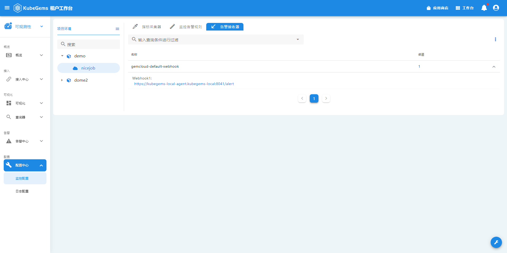
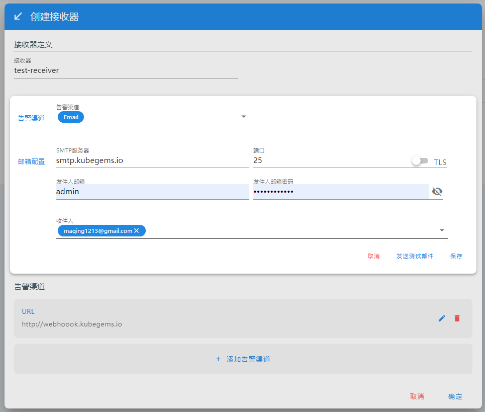
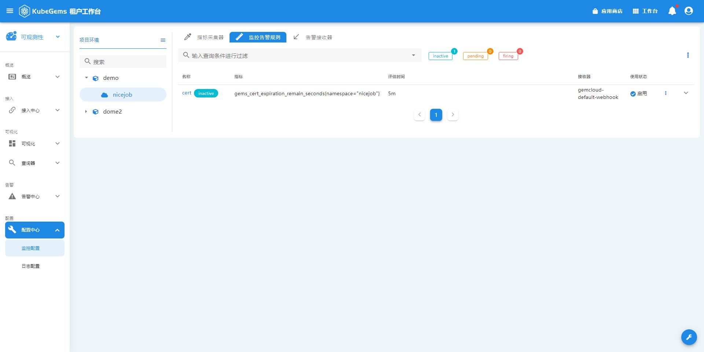
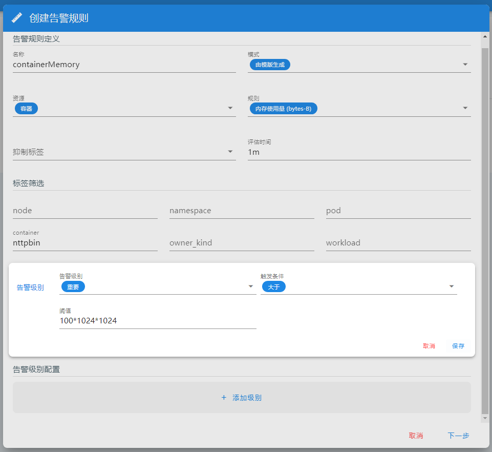
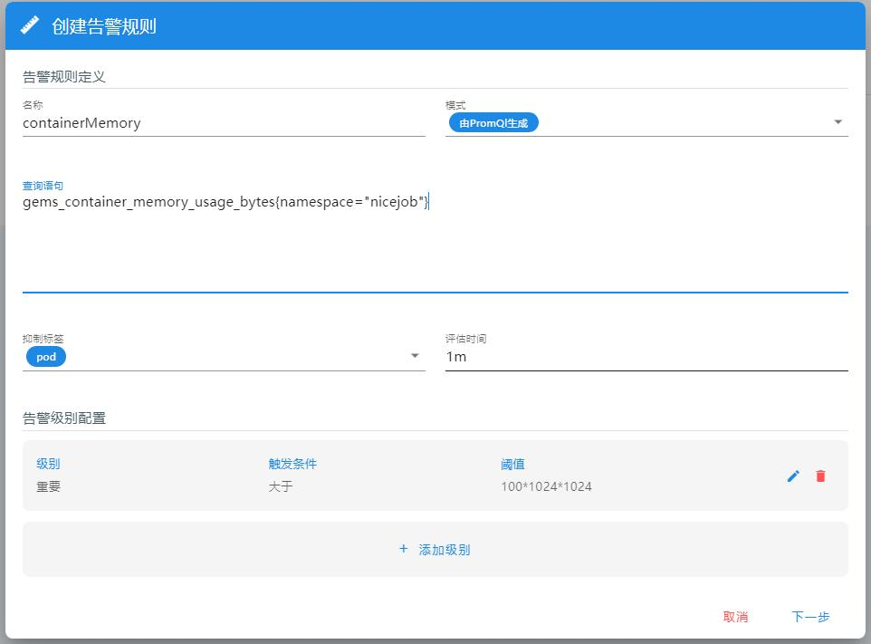
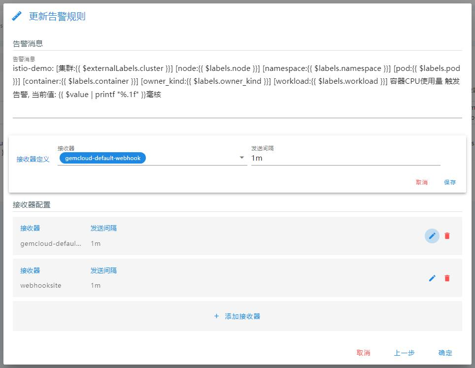

## 监控告警

通过配置 _告警接收器_ 与 _告警规则_，Kubegems平台会在告警触发时将相关告警信息分发至对应渠道，同时，每条告警也会发送至平台内部，用以平台通知、存档。

### 告警接收器

1. 点击左上角，选择**可观测性**
2. 在可观测性栏目，选择**配置中心-监控配置**
3. 选择对应的项目-环境后，点击**告警接收器**

:::tip 小知识
`gemcloud-default-receiver`是平台默认接收器，它会把接收到的告警消息分发给每个 **环境用户**，你无法对它进行修改、删除。
:::
4. 创建/编辑接收器

告警接收器目前支持两种渠道发送告警消息: `webhook`与`邮件`。

- _webhook_: 将告警信息会以`POST`的`http`请求发送至你配置的`URL`
- _邮件_：将告警信息以`SMTP`协议发送至目标邮箱，配置见下表:

| 字段名         | 释义                                                                                                                    |
| :------------- | :---------------------------------------------------------------------------------------------------------------------- |
| 名称           | 接收器名，注意名为`gemcloud-default-webhook`是平台的 **默认接收器**, 他会在告警规则中被默认添加上，不允许用户编辑、删除 |
| SMTP服务器     | SMTP服务器地址                                                                                                          |
| 端口           | 使用SMTP服务器哪个端口发送邮件, 默认`25`                                                                                |
| TLS            | 是否要求SMTP服务器启用TLS, 默认`false`                                                                                  |
| 发件人邮箱     | 发件人邮箱                                                                                                              |
| 发件人邮箱密码 | 发件人邮箱密码                                                                                                          |
| 收件人         | 收件人邮箱，从平台用户邮箱中选择，可多选                                                                                |

:::caution 注意
SMTP协议有多种用户认证方式，如：`CRAM-MD5`, `LOGIN`和`PLAIN`，我们支持的是 `LOGIN`和`PLAIN`
:::

export const Highlight = ({children, color}) => (
  
    {children}
  
);

配置邮箱时，你可以通过点击  <Highlight color="#34b4eb">发送测试邮件</Highlight> 来测试邮箱是否正确配置。

若你收到主题为`Kubegems test email`的邮件，说明邮箱配置无误。

:::tip 小技巧
你可以在一个接收器中同时添加多条`webhook`和`邮件`告警渠道，他们将几乎同时收到相同的告警消息
:::tip

### 告警规则

告警规则配置平台的告警策略，告警触发时按配置发送给对应的接收器

1. 点击左上角，选择**可观测性**
2. 在可观测性栏目，选择**配置中心-监控配置**
3. 选择对应的项目-环境后，点击**监控告警规则**

:::tip 小知识
你会关注到每个告警规则名称后跟了个状态栏，这是表示告警规则当前状态，分为三类:
- _inactive_ : 表示当前告警规则正常，没有触发迹象
- _pending_ : 表示当前时刻已经到达触发条件，但仍在评估中，如果在持续的 _评估时间_ 内一直致满足触发条件，状态便会转为 _firing_
- _firing_ : 表示当前告警规则正在告警
:::

4. 创建/编辑告警规则

- 配置告警规则触发条件

由模板生成:

由promql生成:

- 配置告警规则接收器

:::caution 注意
告警规则按照环境进行了隔离，环境A中的接收器无法接受到环境B中产生的告警消息。原因是每条告警消息分发时按`namespace`做了强制匹配，环境A的接收器收到的告警消息中，若没有对应的`namespace` label会直接drop。

但若你是**管理员用户**，你会注意到有个`system(平台全局)`的空间，在这里你能为所有namespace的资源(包括没有namespace标签的资源如node、cluster)配置告警规则而没有任何限制，这里的接收器也不会做强制的namespace匹配。

我们也在`system(平台全局)`空间中预置了一系列告警规则，你可以自行修改。
:::

告警规则字段及说明:

| 字段名     | 释义                                                                                                                                                            |
| :--------- | :-------------------------------------------------------------------------------------------------------------------------------------------------------------- |
| 名称       | 告警规则名                                                                                                                                                      |
| 命名空间   | 告警规则所在命名空间，`gemcloud-monitoring-system`为全局告警命名空间，其中配置的告警规则没有`namespace`限制，**其他命名空间的告警规则只对该命名空间生效**       |
| 模式       | 告警规则支持两张模式配置：`由模板生成`(指定资源-规则), `由promql生成`(填入原生promql)，两种模式需要配置的字段互斥                                               |
| 资源、规则 | 也就是选择查询的模板及单位，普通用户只能选择有`namespace`属性的模板                                                                                             |
| 标签筛选   | 进一步筛选你关心的告警源(仅在由模板生成时有效)                                                                                                                  |
| 查询语句   | 触发告警规则的promql，如果不是在system空间，必须包含namespace选择器                                                                                             |
| 抑制标签   | 当有多个告警级别时，通过此处配置的一个或多个标签来做告警抑制，更多请参考 https://prometheus.io/docs/alerting/latest/configuration/#inhibit_rule                 |
| 评估时间   | 告警触发持续多久后才发送告警消息                                                                                                                                |
| 告警级别   | 告警级别有`重要`、`紧急`,  同一条告警规则，告警级别不能重复，且当两个告警级别都触发是，`紧急`的告警规则会抑制`重要`的告警规则，避免不同等级告警重复发送         |
| 告警消息   | 配置告警消息的发送内容，如果为空，Kubegems会在你保存时**自动**生成告警消息，填写告警规消息时，你可以指定变量，详见[告警消息引用变量规则](#告警消息引用变量规则) |
| 接收器     | 选择你在 **告警接收器** 中配置的接收器，你可以添加多个接收器                                                                                                    |
| 发送间隔   | 告警触发后，每隔多久向指定接收器发送一次告警，如`30s`、`5m`、`1h`                                                                                               |

:::caution 注意
由于kubegems 使用`alertmanager`作为告警分发，对于告警分发由多个时间参数控制，这里的`发送间隔`会被应用为`repeat_interval`, 除此之外还有`group_wait`、`group_interval`，我们默认设置为`30s`。

你可以翻阅 [alertmanager文档](https://prometheus.io/docs/alerting/latest/configuration/#route) 了解更多
:::

5. 启用/禁用告警规则
你可以在告警规则列表，边界地启用/禁用指定告警规则。

若一条告警规则被禁用，他在 `firing` 状态下也不会发送告警信息。

#### 告警消息引用变量规则

1. 集群名称: `{{ $externalLabels.cluster }}`
2. 标签名: 你可以在 **配置告警规则触发条件** 时查看支持哪些标签，你可以这样引用该标签变量: `{{ $labels.<label_name> }}`
3. 触发值: `{{ $value }}`

更多信息参考: <https://prometheus.io/docs/prometheus/latest/configuration/alerting_rules/#templating>