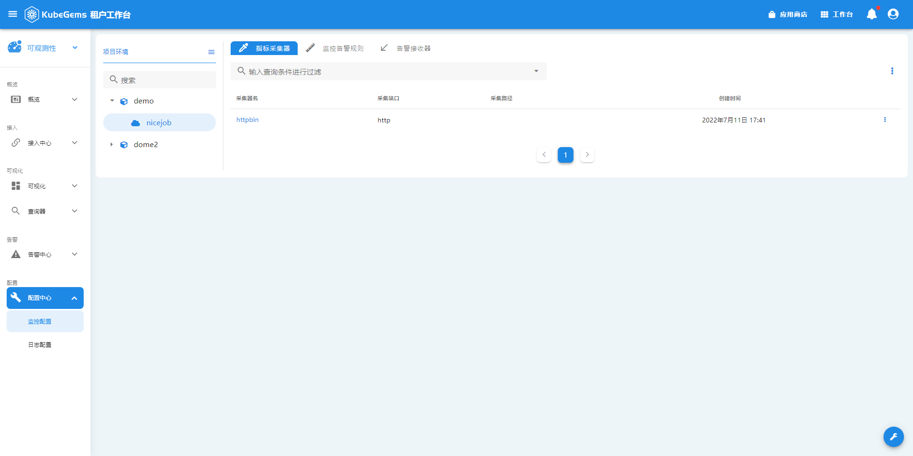

## 指标采集

Kubegems提供了针对`service`的监控指标采集器功能，用户可为自己的应用配置对应的采集器，采集到的指标会汇集在该集群内置的`prometheus`中。

### 创建指标采集器

1. 点击左上角，选择**可观测性**
2. 在可观测性栏目，选择**配置中心-监控配置**
3. 选择对应的项目-环境后，点击**指标采集器**



4. 右上角点击**创建采集器**


字段及释义:

| 字段名       | 释义                                                                                                                                                                                                                                          |
| :----------- | :-------------------------------------------------------------------------------------------------------------------------------------------------------------------------------------------------------------------------------------------- |
| 名称         | 采集器名                                                                                                                                                                                                                                      |
| 关联服务     | 采集器的目标服务                                                                                                                                                                                                                              |
| 端口类型     | 要采集服务的端口类型，端口号: 为 k8s service port name, 端口名：为该service 背后pod的containerPort number                                                                                                                                     |
| 路径         | 在所配置端口上的URL 路径，默认为 `/metrics`                                                                                                                                                                                                   |
| 间隔         | 多久采集一次，例如: `30s`, `1m`, 如果未指定则使用全局配置的scrape_interval(30s                                                                                                                                                              ) |
| 超时         | 采集超时时长，如果未指定则使用全局配置的scrape_timeout(10s)                                                                                                                                                                                   |
| 指标标签优先 | 若采集到的标签和 [Kubegems平台relabel的标签](#Kubegems平台relabel的标签) 重名，是否采集到的指标标签优先，更多信息参考: <https://prometheus.io/docs/prometheus/latest/configuration/configuration/#scrape_config>                              |


#### Kubegems平台relabel的标签

在采集到指标时，平台会进行一系列的 _relabel_ 工作，通过relabel会给指标添加额外的标签，如下:
- `servicemonitor`: job, container, endpoint, instance, namespace, pod, service
- `podmonitor`：job, container, endpoint, instance, namespace, pod

relabel规则大致如下:
```yaml
  relabel_configs:
  - source_labels: [job]
    separator: ;
    regex: (.*)
    target_label: __tmp_prometheus_job_name
    replacement: $1
    action: replace
  - source_labels: [__meta_kubernetes_service_label_name]
    separator: ;
    regex: nginx-ingress-operator
    replacement: $1
    action: keep
  - source_labels: [__meta_kubernetes_endpoint_address_target_kind, __meta_kubernetes_endpoint_address_target_name]
    separator: ;
    regex: Node;(.*)
    target_label: node
    replacement: ${1}
    action: replace
  - source_labels: [__meta_kubernetes_endpoint_address_target_kind, __meta_kubernetes_endpoint_address_target_name]
    separator: ;
    regex: Pod;(.*)
    target_label: pod
    replacement: ${1}
    action: replace
  - source_labels: [__meta_kubernetes_namespace]
    separator: ;
    regex: (.*)
    target_label: namespace
    replacement: $1
    action: replace
  - source_labels: [__meta_kubernetes_service_name]
    separator: ;
    regex: (.*)
    target_label: service
    replacement: $1
    action: replace
  - source_labels: [__meta_kubernetes_pod_name]
    separator: ;
    regex: (.*)
    target_label: pod
    replacement: $1
    action: replace
  - source_labels: [__meta_kubernetes_pod_container_name]
    separator: ;
    regex: (.*)
    target_label: container
    replacement: $1
    action: replace
```


5. 验证监控采集器

访问 <http://prometheus.{cluster_name}.kubegems.io:{gateway_port}/targets> 验证是否成功采集
