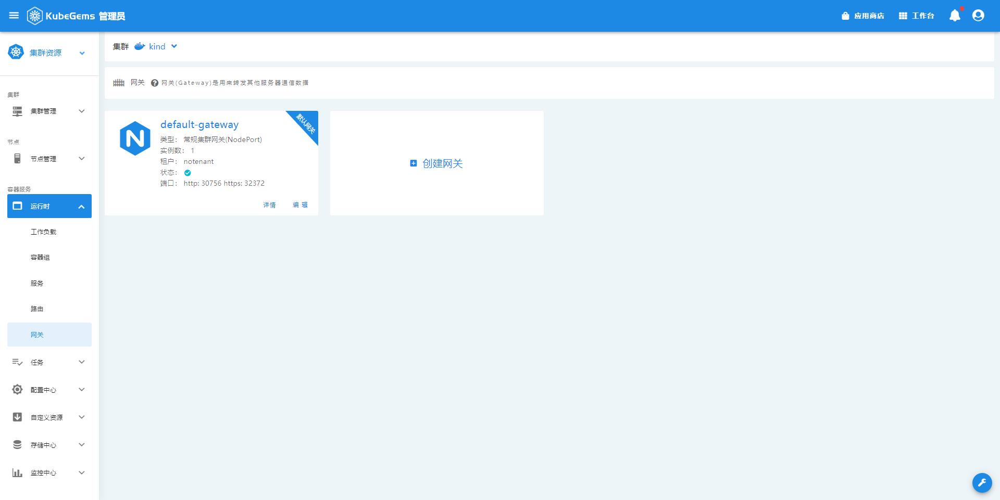
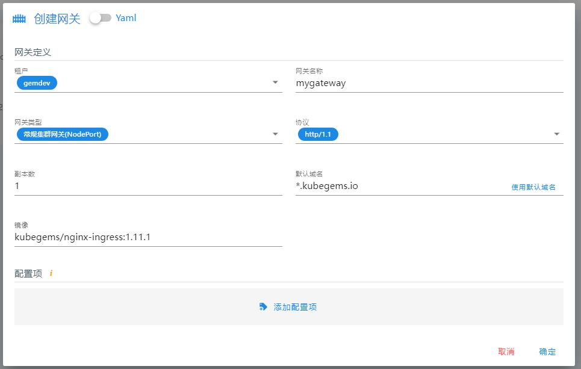

## 租户网关

Kubegems 租户网关基于 [nginx-ingress-operator](https://github.com/nginxinc/nginx-ingress-operator) 提供租户级的服务网关，支持`http1.1`、`http2`、`websocket`、`grpc`等多种协议的网关、路由配置。
租户网关分为两类:
- _默认网关_ : 每个集群中内置名为`default-gateway`的网关，所有租户共享，不可删除
- _普通网关_ : 由租户用户创建、管理，用户在创建路由时只能选择当前租户下的网关或默认网关

### 创建租户网关

1. 点击右上角**工作台**
2. 选择一个环境，点击**进入环境**
3. 在左侧边栏**运行时**，选择**网关**

4. 点击**创建网关**

| 字段名   | 释义                                                                                                                                                                  |
| :------- | :-------------------------------------------------------------------------------------------------------------------------------------------------------------------- |
| 租户     | 网关所属租户，非管理员用户默认填充为当前租户                                                                                                                          |
| 网关名称 | 输入网关的名字，网关名称会在创建 `ingress` 时通过 `ingressClassName` 进行绑定                                                                                         |
| 网关类型 | 访问网关的类型，默认为 `NodePort` 即使用主机端口访问访问。`LoadBalancer` 类型为对接公有云时可指定相关 `annotation` 进行网关的创建                                     |
| 协议     | 选择网关支持的协议类型，支持 `http1/1` 和 `http/2` 两种类型，要注意`http/2`协议目前只在代理启用了`ssl`的服务时才生效                                                  |
| 副本数   | nginx实例个数                                                                                                                                                         |
| 默认域名 | 通过配置带有通配符`*`的默认域名，在创建路由规则时，若没指定host，会随机生成匹配默认域名的子域名, 默认`*.kubegems.io`                                                  |
| 镜像     | nginx实例所使用的镜像，默认为`kubegems/nginx-ingress:1.11.1`                                                                                                          |
| 配置项   | 以`key-value`的形式配置nginx实例的全局配置，支持的配置项参见 <https://docs.nginx.com/nginx-ingress-controller/configuration/global-configuration/configmap-resource/> |

### 查看网关状态
网关创建完成后，可以关注以下信息：

- **端口**: 网关服务端口号，同时会展示`80`及`443`端口映射的`NodePort`
- **网关地址**: 根据不同类型的网关(`NodePort`/`LoadBanlancer`)列出外部可访问到的URL
:::tip 小技巧
点击 **访问** 即可访问该网关代理地址
:::
- **容器组**：该网关的nginx实例信息
- **路由**: 通过该网关转发的`ingress`路由规则
- **监控**: 展示该网关所有实例的`qps`与`连接数`状态