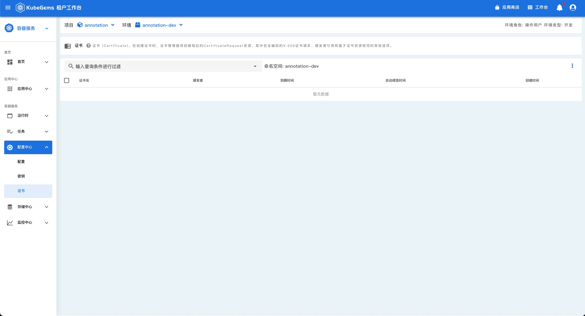
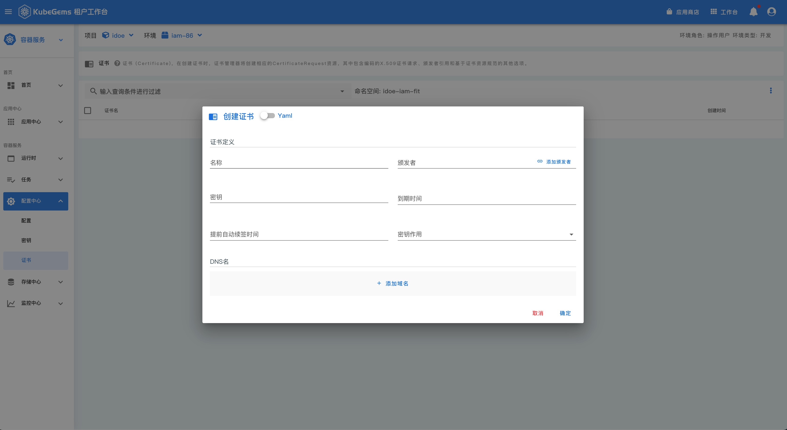
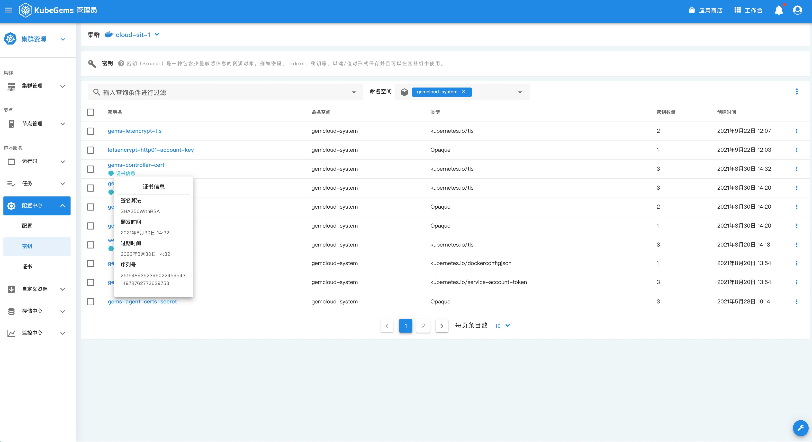

## 证书管理

---

### 概述

随着 HTTPS 不断普及，大多数网站开始由 HTTP 升级到 HTTPS。使用 HTTPS 需要向权威机构申请证书，并且需要付出一定的成本，如果需求数量多，则开支也相对增加。**cert-manager** 是 Kubernetes 上的全能证书管理工具，支持利用cert-manager基于[ACME](https://tools.ietf.org/html/rfc8555)协议与[Let's Encrypt](https://letsencrypt.org/) 签发免费证书并为证书自动续期，实现永久免费使用证书。

KubeGems 平台内置 **cert-manager** 服务，用于集中管理管理Kubernetes内部的自签名TLS证书。

### Cert-manager工作机制

cert-manager 部署到 Kubernetes 集群后会查阅其所支持的自定义资源 CRD，可通过创建 CRD 资源来指示 cert-manager 签发证书并为证书自动续期。如下图所示：


- Issuer/ClusterIssuer：用于指示 cert-manager 签发证书的方式，本文主要讲解签发免费证书的 ACME 方式。
说明：

:::tip 信息
Issuer 与 ClusterIssuer 的主要区别为，Issuer 只能用来签发自身所在 namespace 下的证书，ClusterIssuer 可以签发任意 namespace 下的证书。
:::

- Certificate：用于向 cert-manager 传递域名证书的信息、签发证书所需要的配置，以及对 Issuer/ClusterIssuer 的引用。

### 自签证书

自签名TLS证书广泛在后端服务间需要安全加密场景下使用。传统的自签名TLS证书需要开发者在本地创建`CA和描述文件来生成证书和密钥`，整个过程繁琐且复杂，时而还会因为安全问题，不能将证书有效期设置太长。

当您的应用使用KubeGems后，便再无上述问题，KubeGems平台内的TLS/SSL证书可以由平台自动进行创建、续签等管理。

**操作步骤**

1、进入 【环境空间】，展开【配置中心】选择进入 【证书】 页面。



2、点击页面右上角 【创建证书】



- 名称：证书资源名称

- 签发者：证书签发者，自签名证书需要提前创建签发者

- 密钥: 保存证书的secret名称

- 到期时间： 证书有效期

- 启动自动续签时间： 提前自动续签的时间

- 密钥作用： 证书使用类型

- DNS域签名： 对DNS域名进行证书授信

3、创建完成后，在 【证书】 列表里面查到证书的有效期，也可以在 【密钥】 中查看证书详情




:::info 小技巧
当密钥类型是TLS/SSL时，鼠标移动到 【证书信息】 将浮动展现该证书的有效信息！
:::

### Let's encrypt免费证书

Let’s Encrypt 利用 ACME 协议校验域名的归属，校验成功后可以自动颁发免费证书。免费证书有效期只有90天，需在到期前再校验一次实现续期。使用 cert-manager 可以自动续期，即实现永久使用免费证书。校验域名归属的两种方式分别是 HTTP-01 和 DNS-01，校验原理详情可参见 [Let's Encrypt 的运作方式](https://letsencrypt.org/zh-cn/how-it-works/)。

**HTTP-01 校验原理**

HTTP-01 的校验原理是给域名指向的 HTTP 服务增加一个临时 location。此方法仅适用于给使用 Ingress 暴露流量的服务颁发证书，并且不支持泛域名证书。
例如，Let’s Encrypt 会发送 HTTP 请求到 `http://<YOUR_DOMAIN>/.well-known/acme-challenge/<TOKEN>`**。YOUR_DOMAIN** 是被校验的域名。**TOKEN** 是 ACME 协议客户端负责放置的文件，在此处 ACME 客户端即 cert-manager，通过修改或创建 Ingress 规则来增加临时校验路径并指向提供 **TOKEN** 的服务。Let’s Encrypt 会对比 **TOKEN** 是否符合预期，校验成功后就会颁发证书。

**DNS-01 校验原理**

DNS-01 的校验原理是利用 DNS 提供商的 API Key 拿到用户 DNS 控制权限。此方法不需要使用 Ingress，并且支持泛域名证书。
在 Let’s Encrypt 为 ACME 客户端提供令牌后，ACME 客户端 **\(cert-manager\)** 将创建从该令牌和帐户密钥派生的 TXT 记录，并将该记录放在 `_acme-challenge.<YOUR_DOMAIN>`。Let’s Encrypt 将向 DNS 系统查询该记录，找到匹配项即可颁发证书。

**操作步骤**

使用 HTTP-01 的校验方式，需要用到 Ingress 来配合校验。cert-manager 会通过自动修改 Ingress 规则或自动新增 Ingress 来实现对外暴露校验所需的临时 HTTP 路径。为 Issuer 配置 HTTP-01 校验时，如果指定 Ingress 的 name，表示会自动修改指定 Ingress 的规则来暴露校验所需的临时 HTTP 路径，如果指定 class，则表示会自动新增 Ingress，可参考以下 示例。

```yaml
apiVersion: cert-manager.io/v1
kind: Issuer
metadata:
  name: letsencrypt-http01
  namespace: prod
spec:
  acme:
    server: https://acme-v02.api.letsencrypt.org/directory
    privateKeySecretRef:
      name: letsencrypt-http01-account-key
    solvers:
    - http01:
       ingress:
         name: web # 指定被自动修改的 Ingress 名称
```

使用 Issuer 签发证书，cert-manager 会自动创建 Ingress 资源，并自动修改 Ingress 的资源 prod/web，以暴露校验所需的临时路径。参考以下代码示例，自动新增 Ingress：

```yaml
apiVersion: cert-manager.io/v1
kind: Issuer
metadata:
  name: letsencrypt-http01
  namespace: prod
spec:
  acme:
    server: https://acme-v02.api.letsencrypt.org/directory
    privateKeySecretRef:
      name: letsencrypt-http01-account-key
    solvers:
    - http01:
       ingress:
         class: nginx # 指定自动创建的 Ingress 的 ingress class
```

成功创建 Issuer 后，参考以下代码示例，创建 Certificate 并引用 Issuer 进行签发：

```yaml
apiVersion: cert-manager.io/v1
kind: Certificate
metadata:
  name: test-mydomain-com
  namespace: prod
spec:
  dnsNames:
  - test.mydomain.com # 要签发证书的域名
  issuerRef:
    kind: Issuer
    name: letsencrypt-http01 # 引用 Issuer，指示采用 http01 方式进行校验
  secretName: test-mydomain-com-tls # 最终签发出来的证书会保存在这个 Secret 里面
```

如果您有多个应用都使用一套Let's encrypt证书的场景，可以尝试在 Certificate 内签名多个 dnsNames ，最终在Ingress上验证签名时，通过关联多个服务即可实现。例如：

```yaml
apiVersion: extensions/v1beta1
kind: Ingress
metadata:
  annotations:
    nginx.org/proxy-buffering: "false"
    nginx.org/websocket-services: gems-dashboard
  name: gems-dashboard-letencrypt
  namespace: gemcloud-system
spec:
  rules:
  - host: console.kubegems.io
    http:
      paths:
      - backend:
          serviceName: gems-dashboard
          servicePort: 8000
        path: /
        pathType: ImplementationSpecific
  - host: docs.kubegems.io
    http:
      paths:
      - backend:
          serviceName: gems-docs
          servicePort: 80
        path: /
        pathType: ImplementationSpecific
  tls:
  - hosts: 
    - console.kubegems.io
    - docs.kubegems.io
    secretName: gems-letencrypt-tls
```
